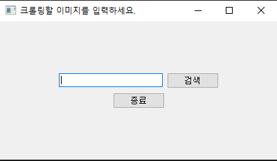
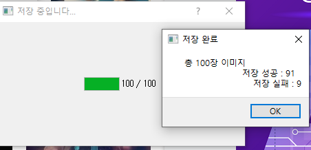

# MyWebCrawler
나만의 웹 크롤러

## 1. 개발 기간 및 참여 인원
* 2023.07.12 ~ 2023.07.17
* 개인 프로젝트

## 2. 기술 스택
* Python
* PyQt5
* Selenium

## 3. 핵심 기능

1. 검색 

  
   

  
 2. 크롤링 

  
    

  
 3. 저장 

  
  

## 4. 오류 및 개선 사항

## 5. 저작권 및 라이선스
* GNU GPL v3
* Apache-2.0
